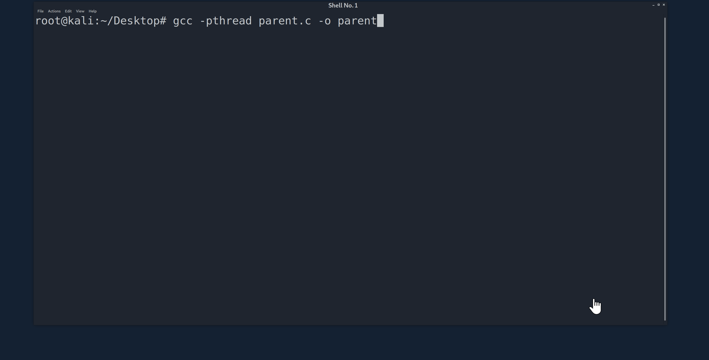

# ezEmuELF

ezEmu enables users to test adversary behaviors via various execution techniques. Sort of like an "*offensive framework for blue teamers*", ezEmu does not have any networking/C2 capabilities and rather focuses on creating local test telemetry.

ezEmu is compiled as `parent` to simplify process trees, and will track (and also kill) child processes to enable easy searches in logs/dashboards.

Current execution techniques include:

- *sh via system() (T1059.004)*
- *Python via popen() (T1059.006)*
- *Perl via system() (T1059)*

## Usage/Demo

ezEmu is an interactive terminal application and works much better if you run from a terminal

Compiled with GCC (ex: `gcc -pthread parent.c -o parent`)

____

### Notice 

Copyright 2020 The MITRE Corporation

Approved for Public Release; Distribution Unlimited. Case Number 20-1357.

Licensed under the Apache License, Version 2.0 (the "License");
you may not use this file except in compliance with the License.
You may obtain a copy of the License at

   http://www.apache.org/licenses/LICENSE-2.0

Unless required by applicable law or agreed to in writing, software
distributed under the License is distributed on an "AS IS" BASIS,
WITHOUT WARRANTIES OR CONDITIONS OF ANY KIND, either express or implied.
See the License for the specific language governing permissions and
limitations under the License.

The author's affiliation with The MITRE Corporation is provided for identification purposes only, and is not intended to convey or imply MITRE's concurrence with, or support for, the positions, opinions or view points expressed by the author.
